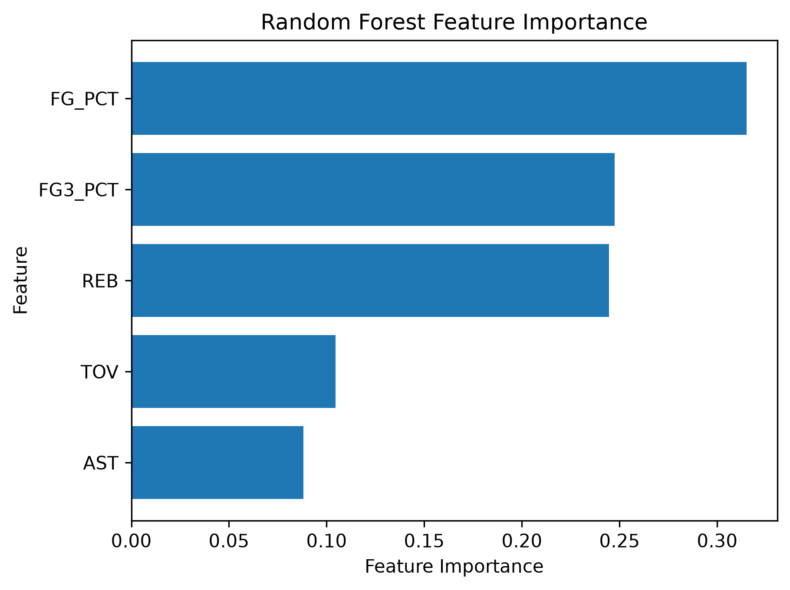

# 🏀 NBA Thunder Win Prediction Analysis

A data analysis project that investigates which game statistics contribute most to the Oklahoma City Thunder's victories during the 2024–25 NBA season.

## 📌 Project Overview

The objective of this project is to identify the key factors associated with winning games using statistical analysis and machine learning.

The workflow includes:

- Data collection using the NBA API
- Exploratory Data Analysis (EDA)
- Statistical hypothesis testing (t-test)
- Random Forest classification
- Feature Importance analysis
- Cross Validation

---

## 🛠 Tech Stack

- Python
- pandas
- NumPy
- matplotlib
- scipy
- scikit-learn
- nba_api
- Jupyter Notebook

---

## 📂 Project Structure

```
nba-thunder-analysis/
│
├── data/
│   ├── raw/
│   └── processed/
│
├── notebooks/
│   └── 01_data_collection.ipynb
│
├── images/
│
├── src/
│
├── requirements.txt
└── README.md
```

---

## 📊 Exploratory Data Analysis

The average values of major game statistics were compared between wins and losses.

Variables analyzed:

- FG%
- 3PT%
- Rebounds
- Assists
- Turnovers

---

## 📈 Statistical Analysis

An independent two-sample t-test was performed.

Result:

- FG% showed a statistically significant difference.
- Other variables showed smaller or non-significant differences.

---

## 🤖 Machine Learning

Model:

- Random Forest Classifier

Features:

- FG%
- 3PT%
- Rebounds
- Assists
- Turnovers

Target:

- Win / Loss

Cross Validation Results

| Metric | Score |
|--------|------:|
| Accuracy | 0.734 |
| Precision | 0.865 |
| Recall | 0.812 |
| F1-score | 0.827 |

---

## ⭐ Feature Importance



The Random Forest model identified **FG%** as the most influential feature for predicting game outcomes.

Three-point shooting percentage and rebounds were also important contributors, while assists and turnovers had relatively smaller contributions.
---

## 💡 Conclusion

This analysis suggests that shooting efficiency (FG%) is the strongest predictor of winning games.

Rebounding and three-point shooting also contribute substantially to game outcomes.

The project demonstrates an end-to-end data science workflow from data collection through statistical testing and predictive modeling.

---

## 🚀 Future Work

- ROC Curve / AUC
- Hyperparameter tuning
- XGBoost comparison
- SHAP value analysis
